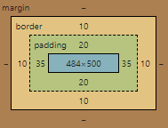
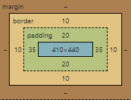

# Práctica de HTML y CSS

## Tipos de imágenes
Existen dos tipos de imágenes:
- **Con pérdida (Lossy)**: Podemos reducir el tamaño del archivo, aunque pueden perder calidad.
    -  JPG / JPEG _Photographic Experts Group_ (Fotografías e imágenes fijas)
- **Sin pérdida (Lossless)**: No se pierde nada del archivo original.
    - GIF _Graphics Interchange Format_
    - PNG 8 _Portable Network Graphics_ (Logotipos e imagenes con transparencia)
    - PNG 24 _Portable Network Graphics_ (Maneja más colores que PNG 8)
    - SVG - Vector _Scalable Vector Graphics_ (Iconos y logotipos escalables)


El peso de las imágenes es muy importante ya que puede perjudicar la carga de nuestro sitio web.

Por lo general los archivos con pérdida son mucho más pequeños que los archivos sin pérdida, lo que los hace ideales para usar en línea donde el tamaño del archivo y la velocidad de descarga son vitales.

## Optimización de imágenes
El tamaño promedio de una imagen para la web es de 70KB, y por lo regular debemos tratar que cada imagen de nuestro sitio pese menos de 100KB.

Algunas herramientas que nos ayudan a optimizar nuestras imágenes son:
- [Compressor](https://compressor.io/) Compresión de imágenes.
- [Squoosh](https://squoosh.app/) Compresión de imágenes.
- [Tiny PNG](https://tinypng.com/) Mejora el tamaño de las imágenes.
- [Verexif](https://www.verexif.com/) Retira metadatos de imágenes (fecha de captura y demás).
- [Picresize](https://picresize.com/) Cambia el tamaño de la imágen.
- [Convertio](https://convertio.co/es/jpg-svg/) Convertir de un formato a otro.

## Renderizar imágenes
La forma correcta semánticamente de renderizar una imagen con un contenedor y un título / subtítulo es de la siguiente forma:

```html
<figure>
  
  <figcaption>This is a picture of kittens🐈</figcaption>
</figure>
```

## Videos
Podemos renderizar videos dentro de nuestra página de la siguiente forma:

```html
<video src="" controls preload="auto"></video>
```

Sin embargo, no todos los navegadores entienden todos los formatos de video, por lo que podemos proporcionar más de una opción de video con diferentes formatos, dejando que el navegador decida cuál utilizar. Para lograr esto debemos omitir el atributo _src_ y dentro de la etiqueta `<video></video>` colocar nuestras fuentes con una etiqueta `<source src="" />`
```html
<video controls preload="auto">
  <source src="formato1.mp4" />
  <source src="formato2.m4v" />
</video>
```

También podemos indicar el segundo de inicio y fin para la reproducción del video de la siguiente forma:
```html
<video src="video1.mp4#t=10,60" controls preload="auto"></video>
```

# CSS

## Nombrar clases CSS
Existen diversas metodologías para nombrar nuestras clases de CSS y poder mantener un orden y mejorar el mantenimiento de nuestro sitio.

Una de las más utilizadas es la metodología [BEM](https://en.bem.info/methodology/faq/#why-bem).


## Especificidad y orden de declaración
¿Cómo se controla el orden al declarar CSS?
1. Importancia
2. Especificidad
3. Orden en las fuentes (etiquetas link)

Si dos declaraciones tienen la misma _importancia_, la _especificidad_ de las reglas decidirá cuál se debe aplicar. Si las reglas tienen la misma especificidad, el orden de las fuentes controla el resultado final.

### Importancia
1. Estílos del navegador
2. Declaraciones normales en hojas de estílo de autor (nuestro CSS)
3. Declaraciones importantes en hojas de estílos de autor (Utilización del !important) **¡ESTO ES MUY MALA PRÁCTICA!**

### Especificidad

| Selector        | Especificidad   |
| :-	            | :-:	            |
| !important      | 1,0,0,0,0       |
| Inline styles   | 0,1,0,0,0       |
| #id             | 0,0,1,0,0       |
| .class          | 0,0,0,1,0       |
| tag             | 0,0,0,0,1       |

Podemos usar más de un selector para una regla CSS, lo cuál le dará mayor especificidad.
Existen herramientas como [codecaptain](https://www.codecaptain.io/tools/css-specificity-calculator) para calcular la especificidad de un selector.

### Conflicto en declaraciones CSS
Cuando el navegador encuentra un conflicto para aplicar los estílos, su algoritmo _cascade_ sigue el siguiente flujo para decidir qué regla aplicar:
1. Declaraciones con _!important_
2. Estílos en línea (inline styles)
3. Selector con mayor especificidad
4. Estílos del navegador

### Orden de las fuentes
Las declaraciones al final del documento anularán a las que sucedan antes en caso de conflicto.

Esto es importante tenerlo en cuenta, pues si importamos nuestros estílos antes de los estílos de un tercero, podrían reescribirse los nuestros.

### Ejemplo de especificidad
```css
/* Los estílos de este selector serán los aplicados por tener mayor especificidad sumada (1,2,0) */
.clase-1.clase-2#un-id {
  color: red;
}

/* Especificidad: (1,0,0) */
#un-id {
  color: violet;
}
```

## Modelo de caja
Los elementos renderizados en HTML son como cajas, las cuales están formadas por el contenido, padding, border y margin.

Por ejemplo, si aplicamos el siguiente CSS:

```css
main {
  width: 100%;
  height: 500px;
  border: 10px solid grey;
  padding: 20px 35px;
}
```

Nuestro modelo de caja se verá como en la siguiente imagen en una pantalla de 500px de ancho:



En la página ahora tendremos un scroll horizontal, pero ¿por qué?. En la regla css hemos definido que el width debe ser del 100%, sin embargo nuestra caja ocupa más que el 100% del ancho debido a que no toma en cuenta el padding y border que hemos definido como parte de la medida total, sino más bien como un extra.

Si sumamos los valores del ancho del border, padding y content (10 + 35 + 484 + 35 + 10) obtendremos **574px** (Nuestra pantalla tiene 500px de ancho).

Los navegadores agregan unos estílos por defecto a algunos elementos. Para solucionar nuestro problema (queremos eliminar el scroll horizontal), nos apoyaremos del selector global `*` de la siguiente forma:

```css
* {
  padding: 0;
  margin: 0;
  box-sizing: border-box;
}
```

`box-sizing: border-box;` define que el ancho que indiquemos debe ser calculado tomando en cuenta el borde, padding y content; quedando nuestro modelo de caja de la siguiente forma:



Teniendo así, los 500px que tiene nuestra pantalla de ancho, logrando eliminar el scroll horizontal.


## Pseudo clases
Definen el estílo de un estado especial de un elemento. Por ejemplo, `:hover` aplicará un estilo cuando el usuario haga hover sobre el elemento especificado por el selector.

Sintaxis: `:class`

```css
.main-nav__item a:hover {
  color: blue;
}
```

[Lista de pseudo clases](https://developer.mozilla.org/es/docs/Web/CSS/Pseudo-classes)


## Pseudo elementos
Definen el estílo de una parte específica de un elemento. Por ejemplo, el pseudoelemento `::first-line` selecciona solo la primera línea del elemento especificado por el selector.

Sintaxis: `::element`

```css
.main-nav__item::after {
  content: ' | ';
}
```

[Lista de pseudo elementos](https://developer.mozilla.org/es/docs/Web/CSS/Pseudo-elements)


## Herencia
Podemos heredar el valor de una propiedad de CSS del elemento padre por medio del keyword `inherit`.

**inherit**: Es un valor permitido en todas las propiedades CSS. Hace que el elemento al cual se aplica tome el valor calculado de la propiedad de su elemento padre.

**initial**: Cuando asignamos este valor a alguna propiedad, se asigna el valor inicial y predefinido por el navegador en cuestión.

**unset**: Es una combinación entre _inherit_ e _initial_, cuando utilizamos este valor en una propiedad ésta tratará de heredar el valor de su elemento padre si está disponible, y utilizará el valor inicial en caso contrario.
